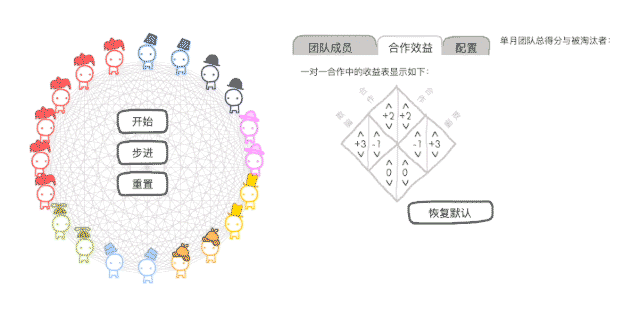

# 公司博弈轮

## 简介

这是一个公司内部团队的评测项目。
我们通过博弈论的方式，评测一个公司的团队中，如果有各种类型的人，他们之间相互合作与不合作，那么

* 对团队创造的整体效益会产生什么影响？
* 对整个团队的内部会产生什么影响？
* 从长期来看，这个团队会变成什么样子？

## 理论介绍

* 博弈论：合作与欺骗。人与人之间的互动关系可以简单划分为：合作 、欺骗。参考 [Game Theory](https://en.wikipedia.org/wiki/Game_theory)
* 本项目的理论来自阿克塞尔罗德的书 【[合作的复杂行为](https://book.douban.com/subject/3094759/)】
  该书让我们以可计算的方式来模拟现实情况中的博弈关系。
  我们把这个方式延伸到公司内部，通过这个方式，我们可以模拟出一个公司内部团队的博弈关系。

### 公司团队内的8项人格列表

我们在团队成员选项中设置了8项人格，这些人格分别是：

* 小白甜：总是与他人合作。（没有资源，不管与谁接触，都只能选择合作）
* 别惹我：一开始合作，但你骗我一次，我会一直教训你，一直不合作。 （报复心强）
* 大刺头：总是不合作。（有能力，有脾气，所以总是不合作）
* 机灵鬼：一开始琢磨不定，一会合作一会不合作，然后就长期保持一个态度，合作或者不合作。（对其他人不清楚的情况下，总是先试探其他人，然后再采取自己的策略）
* 有原则：一开始合作，下一次，你上一次采取什么行动，我就按照你上次一次采取的行动来对待你。（你怎么对我，我就怎么对你）
* 老实人：一开始合作，你骗了他两次，他才采取不合作作为回应。 （反应迟钝，你骗了我两次，才采取对策）
* 胡乱来： 每次选择都是随机
* 没原则：先合作，然后，如果你在上一轮合作，我继续上一步的选择（不管是否犯错）。如果你上一轮欺骗，我就跟我上一轮做相反的选择（不管是否犯错）（只要对方欺骗自己，就改自己的行动，不管对错。如果对方不欺骗自己，也就不改自己的行动）

当然，现实情况中，可能不止这8种人格，只是我们认为这8种人格比较有代表性。
而且，在模拟时，我们可以加入随机值，来体现 在现实情况下很多时候的人们行为的不确定性。

### 公司团队内的工作方式

现代工作一般都需要多人合作完成，这些人一般是处于一个团队内，随机两两组合去完成一个工作。
因此，我们在配置选项中设置了下面的参数：

* 我们以月为单位，设置一个团队需要完成的总体任务数
* 每个任务需要，每个团队成员与其他成员合作的人数。（1个人需要和几个人去合作）
* 合作时，俩俩之间合作的次数。（合作时，一般会需要多次的合作）

如果工作简单，那么每个人都减少与其他人合作的人数与次数。
如果工作复杂，那么每个人都会更多的与其他人合作，多人之间的协同合作相对增多，特定两个人之间的合作次数也增多。

**应该了解的限制：** 1个人同时的合作人数不应该超过5个。（超过这个值，我们认为就超过一般人的沟通能力上限）

## 得分

在合作收益选项中，我们可以调节两个人合作的收益，不合作的收益，以及被欺骗的收益。
当你按下步进按钮时，我们会完成一轮计算，也就是一个月工作任务的计算。我们会算出每个人的分数，并且计算出所有人的总分数。

* 得分方法：按照每个人的策略，俩俩配对计算。按照配置选项计算次数。
* 如果有配置犯错比率，在每次计算得分时，加入随机值，来体现犯错的可能性。
* 按照配置选项中的设定，分数最少的人，就淘汰。
* 分数最高的人，就复制去顶替淘汰掉的人（这里有些不太合理的地方，还可以在未来版本中改进）。

当你按下开始按钮时，相当于连续的步进，直到你按下停止按钮。在屏幕上会显示整个团队的总得分以及当月被淘汰者。

## 评测

使用本项目，要注意很多参数都很重要，某一个参数的调整都会导致完全不同的结果。
我们建议大家使用时，要多次反复尝试，主要着重于观察过程，就是在互相博弈的过程中，会发生什么？当调节某个参数时，会发生什么？

* 例如，谁会先被踢出团队？
* 团队的总得分情况是如何变化的？
* 调节合作与欺骗参数值时，临界点的参数是多少？
* 当到达什么情况时，团队整体效益会进入一个稳定点？

## 当前状态与未完成目标

本项目当前完成的是评测这个团队所产生的效益情况，这是一个短期的评测。
采用当前的展示形态，也是因为我们认为，这个展示更有利于大家理解这个项目。

对公司的长期来说，会面临各种个样的问题，这就需要团队在稳定的同时，保持一个多样性，从而可以面对更多外部环境的冲击。
例如：大刺头，一般都有能力，但是会有脾气，所以总是不合作。如果在团队内部的演变中，一开始就把大刺头淘汰掉，可能会对团队的未来生存产生影响。
**我们认为尽量保持团队的多样性与稳定性，是一个长期的目标。**

还有，我们希望可以把每种类型的人格都再进行一个能力打分，这些能力包括几个方面：

* 创造性（指思维发散的能力，能否去尽力搜索当前事物的边缘）
* 能力水平（指团队的技术能力，能否好的完成一份工作，要看团队的能力水平）
* 合作性、（指相互合作的意愿，这是构建当前团队稳定性的基础）
  沟通能力（属于合作性的一部分，对于提高合作性有帮助）
* 自省能力（自我批评的能力，能否尽快认识到自我的错误）

我们希望这几方面尽量平衡，从而让这个团队的整体能力都达到均衡。
当然，在某种情况下，能否在复杂环境中胜出，还得看环境对具体情况，均衡的团队未必是最好的。

**这也是这个项目最重要的意义：**

**我们不清楚什么一定是对的，我们只是想知道，在某种情况下，什么是对的！**

对于整体的评测，还有重要的一个方面就是管理者的素质问题。未来，我们也希望能加入管理者的角色，来看一下，不同类型的管理者会对团队的效益产生什么影响？
例如：

* 固执型的管理者
* 公平型的管理者
* 自大型
* 马屁型
* 卑微型
* 报复型...
  
无疑，这些类型的管理者肯定也会对团队产生致命影响。希望未来有机会都可以加入来评测。

## 声明

本项目修改自： <https://ncase.me/trust/> 与 <https://audreyt.github.io/trust-zh-TW/> 。十分感谢他们的创作。
由于时间有限，大量素材都完全采用上面原版素材，如有侵权，请告知。

## By LarryWang | wechat: wang686ff | email: alexe.cn@gmail.com
